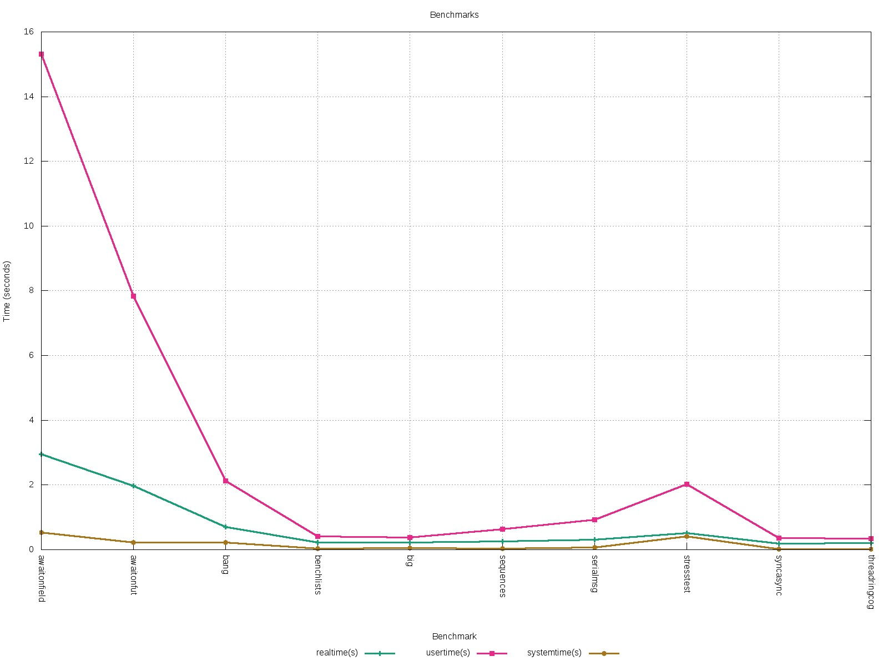

[](https://travis-ci.org/CrispOSS/jabsc) [](https://img.shields.io/coveralls/CrispOSS/jabsc?style=flat-square) [](http://search.maven.org/#browse%7C-1892944679) [](https://github.com/CrispOSS/jabsc/tags) [](https://github.com/CrispOSS/jabsc/blob/master/LICENSE)

# jabsc

`jabsc` is ABS compiler to Java source.

## Usage

### Maven Plugin

We have an [example module][1] to use Maven plugin for jabsc.

### Java

To the use the compiler API:

```java
Compiler compiler = new Compiler(sourceDirectory, outputDirectory);
compiler.compile();
```

and make sure you have the proper Maven dependency:

```xml
<dependency>
   <groupId>com.github.crisposs</groupId>
   <artifactId>jabsc</artifactId>
   <version>${version.jabsc}</version>
</dependency>
```

## Tests

Please refer to [`jabsc-tests`][2] for a set of examples. In addition, the feature coverage of the compiler is testing using [reference examples][3] by Haskell compiler for ABS. 

The legend for the following tables:

* :white_check_mark: ABS source is compiled to Java and its test *passes*.
* :x: ABS source is compiled to Java but its test *fails*.
* :heavy_exclamation_mark: ABS source is compiled to Java but its test *hangs*.
* :bangbang: ABS source fails to compile to *correct* Java.

#### Tests: `compiler/must/`
| Test | State | Test | State |
|----|:----:|----|:----:|----|:----:|
| Arith | :white_check_mark: | AsyncToSameCOG | :white_check_mark: |
| AwaitOnThis | :white_check_mark: | AwaitOnThis2 | :white_check_mark: |
| BenchLists | :white_check_mark: | BenchMaps | :white_check_mark: |
| CatchClauseBugInOtherBackends | | ClassDisjointInterfs | :white_check_mark: |
| Cosimo1 | :white_check_mark: | Cosimo2 | :heavy_exclamation_mark: Object's field reference to a "future" is changed; thus the future is lost. |
| Cosimo3 | :heavy_exclamation_mark: Same as Cosimo2 | Cosimo4 | :white_check_mark: |
| CosimoAsyncRun | :white_check_mark: | Equality | :white_check_mark: |
| ExceptionCase | :white_check_mark: | ExceptionMod | |
| ExceptionPos | | Fail1 | :white_check_mark: |
| Fail2 | :white_check_mark: | FieldToFunc | :white_check_mark: |
| FixBugMonadicStyle | :white_check_mark: | ForeignImport | | 
| Futures | :white_check_mark: | HiddenMethod | :heavy_exclamation_mark: |
| Inference | :bangbang: | InferenceNum | :bangbang: |
| Interfaces | :white_check_mark: | LeaderElection | :white_check_mark: |
| Module | :x: Multi-module in the same file not supported. | MultipleTasksPerObject | :white_check_mark: |
| MultiScope | :white_check_mark: | NonMethods | :heavy_exclamation_mark: |
| Null | :bangbang: | Parens | :white_check_mark: |
| PingPong | :white_check_mark: | PromiseSimple | :x: No definitive semantics. |
| PureCode | :x: | RunAndNonMethods | :white_check_mark: |
| StatefulOO | :white_check_mark: | Subtyping | :white_check_mark: |
| Subtyping2 | :white_check_mark: | TestAwait | :white_check_mark: |
| TestMaps | :white_check_mark: | TestRefs | :white_check_mark: |
| TestThis | :white_check_mark: | ThisSwitching | :white_check_mark: |
| TypeSym | :x: | UpcastingInt | :x: |
| While | :white_check_mark: | | |

## Benchmarks

We use [abs-bench][4] repository to perform benchmarks on generated Java code from jabsc. 
To run the benchmarks:

* Checkout abs-bench and switch to "jabsc" branch
```bash
$ git clone https://github.com/abstools/abs-bench.git
$ cd abs-bench
abs-bench$ git checkout jabsc
```
* Run the benchmarks from jabsc root source directory
```
$ cd /path/to/jabsc
jabsc$ ./jabsc benchmark /path/to/abs-bench/synthetic_par/
```
* The results in CSV format and a GNU Plot result will be generated in `/tmp`.

The latest run of the benchmarks:


 
## Build Parser/Lexer

You need the following *only* if you modify `src/main/resources/ABS.cf` to generate the Lexer and Parser:

1. Ensure you have `bnfc` tool on your `PATH`
2. Run `clean.sh`
3. Run `build.sh`
4. The build should pass

[1]: https://github.com/CrispOSS/jabsc-maven-plugin-example
[2]: https://github.com/CrispOSS/jabsc-tests
[3]: https://github.com/bezirg/abs2haskell/tree/cloud/test
